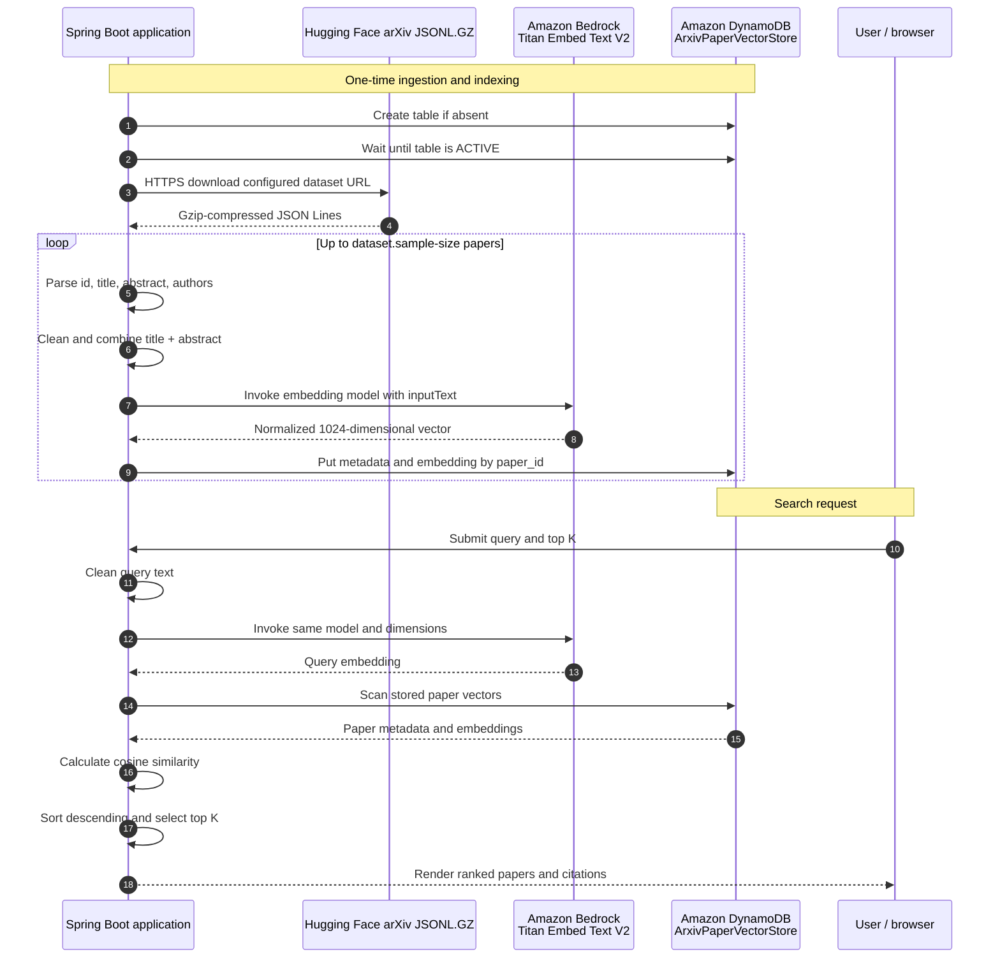
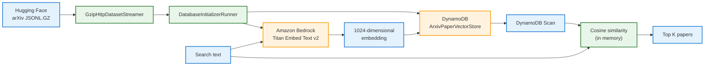

# AWS DynamoDB Vector Search

A Spring Boot application that downloads arXiv papers, generates text embeddings with Amazon Bedrock Titan, stores the papers and vectors in Amazon DynamoDB, and performs an in-memory cosine-similarity search.

> **Current implementation:** the application runs ingestion from an optional `CommandLineRunner` and provides vector search through the Thymeleaf web UI. The current search implementation scans DynamoDB and ranks results in application memory.

For a class-by-class explanation with code snippets, see [`DEEP-DIVE.md`](DEEP-DIVE.md).

The high-level architecture is also available as an editable Excalidraw design: [`aws-dynamodb-vector-search.excalidraw`](aws-dynamodb-vector-search.excalidraw).

## Project structure

```text
src/main/java/com/bsmlabs/vector_search/
├── config/
│   ├── AppProperties.java
│   └── AwsConfig.java
├── infrastructure/
│   └── DynamoDbTableManager.java
├── controller/
│   └── SearchController.java
├── runner/
│   └── DatabaseInitializerRunner.java
├── service/
│   ├── EmbeddingService.java
│   ├── EmbeddingServiceImpl.java
│   ├── GzipHttpDatasetStreamer.java
│   └── PaperVectorService.java
└── domain/
    └── ArxivPaper.java

src/main/resources/
├── application.properties
└── templates/
    └── search.html
```

- `DatabaseInitializerRunner` is a one-time data initialization runner.
-  Enable its `@Component` annotation to create the DynamoDB table, download and ingest the configured dataset, generate embeddings with Amazon Bedrock, and store the paper records.
-  After the initial run completes, keep `@Component` commented out so the application does not repeat table initialization, ingestion, or vector indexing at every startup.
-  `SearchController` serves the Thymeleaf web UI and delegates searches to `PaperVectorService`.

## End-to-end data flow

The application has two related flows: an **ingestion flow** that builds the vector store
and a **search flow** that embeds a user query and ranks the stored papers.



### 1. Configuration enters the application

`AppProperties` binds the `app.aws` namespace from
`src/main/resources/application.properties`:

| Configuration | Used by | Purpose |
| --- | --- | --- |
| `app.aws.dynamo-db.table-name` | `DynamoDbTableManager`, `PaperVectorService` | DynamoDB table used for paper records and vectors |
| `app.aws.dynamo-db.index-name` | Future vector-index implementation | Reserved name for a managed/index-backed search path; not used by the current scan |
| `app.aws.bedrock-properties.model-id` | `EmbeddingServiceImpl` | Bedrock embedding model identifier |
| `app.aws.bedrock-properties.dimensions` | `EmbeddingServiceImpl` | Number of values returned in each embedding |
| `app.aws.bedrock-properties.distance-function` | Future vector-index implementation | Configured similarity distance; current code calculates cosine similarity |
| `app.aws.bedrock-properties.max-embed-chars` | `EmbeddingServiceImpl` | Maximum input characters sent to Bedrock |
| `app.aws.dataset.url` | `GzipHttpDatasetStreamer` | HTTPS source of the gzip-compressed JSONL dataset |
| `app.aws.dataset.sample-size` | `GzipHttpDatasetStreamer` | Maximum number of records read during ingestion |

`AwsConfig` creates the AWS SDK clients. `DynamoDbClient.create()` and
`BedrockRuntimeClient.create()` use the AWS SDK default credential and Region provider
chains, so credentials and Region can come from `aws login`, environment variables,
an AWS profile, or an attached IAM role.

### 2. Ingestion and indexing flow

1. Spring Boot starts `DatabaseInitializerRunner` when its component is enabled.
2. `DynamoDbTableManager.createTableIfNotExists()` creates
   `ArxivPaperVectorStore` with `paper_id` as the string partition key and
   `PAY_PER_REQUEST` billing.
3. `waitUntilActive()` waits until DynamoDB reports the table as `ACTIVE`.
4. `GzipHttpDatasetStreamer` follows redirects to the configured Hugging Face URL,
   validates the HTTP response, decompresses the gzip stream, and reads JSONL records
   until `sample-size` is reached.
5. Each record becomes an immutable `ArxivPaper` containing `id`, `title`,
   `abstractText`, and `authors`.
6. `PaperVectorService.storePaper()` cleans the title and abstract, joins them as
   `cleanTitle + "." + cleanAbstract`, and calls `EmbeddingServiceImpl`.
7. `EmbeddingServiceImpl` invokes Amazon Bedrock Titan Embed Text V2 with the
   configured model ID and dimensions and requests normalized embeddings.
8. `PaperVectorService` stores the metadata and vector in one DynamoDB item keyed by
   `paper_id`.

The stored vector is a DynamoDB list of numeric values. It is not a native DynamoDB
vector index in the current implementation.

### 3. Query and ranking flow

1. A user opens `GET /` and submits the search form with a query and a result count
   between 1 and 20.
2. `SearchController` trims the query and validates that it is not blank.
3. `PaperVectorService.searchInMemory()` embeds the query with the same Bedrock model,
   dimensions, and normalization settings used during ingestion.
4. The service scans the DynamoDB table and reads each stored embedding.
5. Cosine similarity is calculated between the query vector and every paper vector.
6. Results are sorted from highest to lowest similarity and limited to `topK`.
7. Thymeleaf renders the paper title, authors, abstract, score, arXiv identifier,
   direct source link, and citation text.

Because the current ranking path scans DynamoDB and calculates similarity in the
application, it is appropriate for a small demonstration dataset. A production
implementation should replace the full scan with a managed vector index or another
purpose-built approximate nearest-neighbor search service.

## Architecture

```text
                         AWS Cloud

  +-------------------+       +---------------------------+
  | Amazon DynamoDB   |<----->| Spring Boot application   |
  |                   |       |                           |
  | ArxivPaperVector  |       |  1. Create table          |
  | Store             |       |  2. Load papers           |
  |                   |       |  3. Generate embeddings   |
  |  paper_id         |       |  4. Store and scan data   |
  |  title            |       |  5. Calculate similarity  |
  |  abstract         |       +-------------+-------------+
  |  authors          |                     |
  |  embedding        |                     |
  +-------------------+                     |
                                            |
                                  +---------v---------+
                                  | Amazon Bedrock    |
                                  |                   |
                                  | Titan Embed Text  |
                                  | v2                |
                                  +-------------------+

  Hugging Face arXiv JSONL.GZ
                 |
                 v
       Dataset download and parsing
```

The architecture diagram uses AWS service logos loaded from Simple Icons:

<p text-align="center">
  
  &nbsp;&nbsp;&nbsp;&nbsp;
  
  &nbsp;&nbsp;&nbsp;&nbsp;
  
</p>

<table text-align="center">
  <tr>
    <td text-align="center">
      <br>
      <b>Hugging Face</b><br>
      arXiv dataset
    </td>
    <td text-align="center">➜</td>
    <td text-align="center">
      <br>
      <b>Spring Boot</b><br>
      ingestion and search
    </td>
    <td text-align="center">➜</td>
    <td text-align="center">
      <br>
      <b>Amazon Bedrock</b><br>
      Titan embeddings
    </td>
    <td text-align="center">➜</td>
    <td text-align="center">
      <br>
      <b>Amazon DynamoDB</b><br>
      papers and vectors
    </td>
  </tr>
  <tr>
    <td></td>
    <td></td>
    <td text-align="center" colspan="3">↕ query embedding and stored-vector scan</td>
    <td></td>
    <td></td>
  </tr>
</table>



## High-Level Architecture Design

The following high-level design represents the current application boundary. The Spring Boot application is the orchestration layer and can run locally or on an AWS compute service such as Amazon EC2. Amazon Bedrock and Amazon DynamoDB are managed AWS services.

<p text-align="center">
  
  &nbsp;&nbsp;&nbsp;&nbsp;➜&nbsp;&nbsp;&nbsp;&nbsp;
  
  &nbsp;&nbsp;&nbsp;&nbsp;➜&nbsp;&nbsp;&nbsp;&nbsp;
  
  &nbsp;&nbsp;&nbsp;&nbsp;➜&nbsp;&nbsp;&nbsp;&nbsp;
  
</p>

<p text-align="center">
  <b>External dataset and user query</b>
  &nbsp;&nbsp;&nbsp;→&nbsp;&nbsp;&nbsp;
  <b>Spring Boot vector-search application</b>
  &nbsp;&nbsp;&nbsp;→&nbsp;&nbsp;&nbsp;
  <b>Embedding generation</b>
  &nbsp;&nbsp;&nbsp;→&nbsp;&nbsp;&nbsp;
  <b>Metadata and vector storage</b>
</p>



```mermaid
flowchart LR
    subgraph sources["EXTERNAL SOURCES"]
        direction TB
        dataset[("Hugging Face<br/>arXiv JSONL.GZ")]
        user(["User search query"])
    end

    subgraph application["APPLICATION COMPUTE"]
        direction TB
        app["Spring Boot application<br/><small>Local or Amazon EC2</small>"]

        subgraph ingest["INGESTION & INDEXING"]
            direction LR
            load["1 · Download & parse"]
            embedPaper["2 · Generate paper embedding"]
            persist["3 · Store metadata + vector"]
            load --> embedPaper --> persist
        end

        subgraph search["QUERY & RANKING"]
            direction LR
            embedQuery["4 · Generate query embedding"]
            rank["5 · Cosine similarity<br/><small>in application memory</small>"]
            results(["6 · Top K results"])
            embedQuery --> rank --> results
        end

        app -. "orchestrates" .-> load
        app -. "orchestrates" .-> embedQuery
    end

    subgraph aws["AWS MANAGED SERVICES"]
        direction TB
        bedrock["Amazon Bedrock<br/><b>Titan Embed Text v2</b>"]
        dynamodb[("Amazon DynamoDB<br/><b>ArxivPaperVectorStore</b>")]
    end

    dataset -->|"HTTPS · compressed JSONL"| load
    user -->|"query text"| embedQuery

    embedPaper -->|"title + abstract"| bedrock
    bedrock -->|"1024-d vector"| persist
    persist -->|"paper metadata + embedding"| dynamodb

    embedQuery -->|"query text"| bedrock
    dynamodb -->|"Scan stored vectors"| rank
    bedrock -->|"query vector"| rank
    results -->|"ranked papers"| user

    classDef source fill:#E8F1FB,stroke:#5B8CC8,stroke-width:2px,color:#172B4D;
    classDef appNode fill:#EAF6EE,stroke:#2E7D32,stroke-width:2px,color:#173B24;
    classDef process fill:#F4FBF6,stroke:#66A873,stroke-width:1.5px,color:#173B24;
    classDef aws fill:#FFF4E5,stroke:#FF9900,stroke-width:2px,color:#4A2A00;
    classDef result fill:#E8F1FB,stroke:#2563EB,stroke-width:2px,color:#172B4D;
    class dataset,user source;
    class app appNode;
    class load,embedPaper,persist,embedQuery,rank process;
    class bedrock,dynamodb aws;
    class results result;

    style sources fill:#F8FAFC,stroke:#94A3B8,stroke-width:2px,stroke-dasharray: 5 5;
    style application fill:#F8FCF9,stroke:#2E7D32,stroke-width:2px;
    style aws fill:#FFFBF5,stroke:#FF9900,stroke-width:2px;
    style ingest fill:#F1FAF3,stroke:#A7D7AE,stroke-width:1px;
    style search fill:#F1F6FF,stroke:#9DBAE8,stroke-width:1px;

    linkStyle 0,1,2,3 stroke:#2E7D32,stroke-width:2px;
    linkStyle 4,5 stroke:#64748B,stroke-width:1.5px,stroke-dasharray:5 5;
    linkStyle 6,7,14 stroke:#2563EB,stroke-width:2px;
    linkStyle 8,9,10,11,12,13 stroke:#FF9900,stroke-width:2px;
```

### Component responsibilities

| Component | Responsibility |
| --- | --- |
| External dataset | Supplies compressed arXiv paper records containing IDs, titles, abstracts, and authors. |
| Spring Boot application | Coordinates table initialization, ingestion, embedding requests, persistence, and search. |
| Amazon Bedrock | Converts paper content and search queries into normalized 1024-dimensional Titan embeddings. |
| Amazon DynamoDB | Stores paper metadata and embedding vectors using `paper_id` as the partition key. |
| Similarity processor | Scans stored vectors, calculates cosine similarity in memory, sorts scores, and returns the top K papers. |

### Main data flows

1. **Ingestion:** The application downloads the gzip-compressed dataset over HTTPS and parses the configured sample. The `HttpClient`, HTTP response stream, gzip stream, and reader are all managed with try-with-resources so network resources are released after ingestion.
2. **Vectorization:** Each paper's cleaned title and abstract are sent to Amazon Bedrock.
3. **Persistence:** The paper metadata and returned embedding list are written to DynamoDB.
4. **Query:** The search text is sent to the same Bedrock model to produce a comparable vector.
5. **Ranking:** DynamoDB records are scanned and ranked by cosine similarity in the application.

### Deployment boundary

The current code creates AWS SDK clients directly with the SDK default credential and Region provider chain. For a production deployment, run the Spring Boot application in a private Amazon EC2 subnet or another suitable compute environment, attach an IAM role with least-privilege permissions, and restrict outbound access to the required AWS APIs and dataset endpoint.

## Processing flow

1. When enabled for the one-time initialization run, `DynamoDbTableManager` creates `ArxivPaperVectorStore` if it does not already exist.
2. `GzipHttpDatasetStreamer` downloads the compressed arXiv dataset and reads up to the configured sample size. Its `HttpClient` and nested response-processing streams are closed automatically after the download completes.
3. For every paper, the title and abstract are cleaned and concatenated:

   ```text
   clean(title) + "." + clean(abstract)
   ```

4. During initialization, `EmbeddingServiceImpl` sends that text to Amazon Bedrock using the configured Titan embedding model.
5. The returned vector is stored as the DynamoDB `embedding` list attribute together with the paper metadata.
6. A query submitted through the Thymeleaf web UI is embedded with the same Bedrock model.
7. The application scans DynamoDB, calculates cosine similarity between the query vector and each stored vector, sorts by similarity, and renders the top K papers in the web UI.

## Prerequisites

- Java 25
- Maven, or the included Maven wrapper
- An AWS account with:
  - access to Amazon Bedrock Runtime
  - access to Amazon DynamoDB
  - access to the `amazon.titan-embed-text-v2:0` model in the selected AWS Region
- AWS credentials configured through the AWS SDK default credential provider chain:
  - `aws login`, or
  - environment variables, or
  - an AWS profile, or
  - an IAM role when running on AWS

The AWS SDK clients are created with `DynamoDbClient.create()` and `BedrockRuntimeClient.create()`, so the AWS Region and credentials are resolved from the standard SDK configuration chain.

## Configuration

Edit `src/main/resources/application.properties`:

```properties
spring.application.name=aws-dynamodb-vector-search

app.aws.dynamo-db.table-name=ArxivPaperVectorStore
app.aws.dynamo-db.index-name=PaperVectorIndex

app.aws.bedrock-properties.model-id=amazon.titan-embed-text-v2:0
app.aws.bedrock-properties.dimensions=1024
app.aws.bedrock-properties.distance-function=COSINE
app.aws.bedrock-properties.max-embed-chars=20000

app.aws.dataset.url=https://huggingface.co/datasets/gfissore/arxiv-abstracts-2021/resolve/main/arxiv-abstracts.jsonl.gz
app.aws.dataset.sample-size=1000
```

`index-name` and `distance-function` are configuration values for the planned vector-index implementation. The current search path uses a DynamoDB `Scan` followed by in-memory cosine similarity.

## Run locally

1. Configure AWS credentials and select a Region:

   ```bash
   aws login
   export AWS_REGION=us-east-1
   ```

2. Confirm that the Bedrock model is enabled for the selected Region.

3. Start the application:

   ```bash
   ./mvnw spring-boot:run
   ```

   On Windows:

   ```bat
   mvnw.cmd spring-boot:run
   ```

4. For the first run only, temporarily uncomment `@Component` in `DatabaseInitializerRunner.java`, then follow the console output for:
   - DynamoDB table creation and activation
   - dataset download
   - embedding and indexing progress
5. Wait until the table is active and dataset ingestion, embedding generation, and indexing are complete.

> [!NOTE]

- Stop the application, comment `@Component` again, and restart the application. Subsequent starts use the existing DynamoDB data without recreating or re-indexing it.

The application creates the DynamoDB table with on-demand billing (`PAY_PER_REQUEST`). Stop the application with `Ctrl+C` after the workflow completes.

## Web UI testing

Run the web UI only after the application has completed AWS resource initialization, dataset ingestion, embedding generation, and indexing.

Open the Thymeleaf application:

```text
http://localhost:8080/
```

Enter a natural-language query and choose between 1 and 20 results. The page invokes the existing Bedrock-backed vector search, ranks papers by cosine similarity, and displays each paper's title, score, authors, abstract, and arXiv link.

The UI is implemented with Spring MVC and Thymeleaf:

- `GET /` renders `src/main/resources/templates/search.html`.
- `POST /search` submits the search form and renders the results in the same template.
- Blank queries display a validation message.
- Requested result counts are constrained to the range 1–20.
- Search results include the result count, latency, similarity score, paper metadata, and abstract.
- Each result also includes a numbered citation containing the authors, title, and arXiv identifier, alongside the direct arXiv link.

The Maven build includes `spring-boot-starter-thymeleaf` for the application and `spring-boot-starter-thymeleaf-test` for template-related testing support.

## DynamoDB item shape

Each paper is stored with the following attributes:

| Attribute | Type | Description |
| --- | --- | --- |
| `paper_id` | String | DynamoDB partition key |
| `title` | String | Cleaned paper title |
| `abstract` | String | Cleaned paper abstract |
| `authors` | String | Cleaned author text |
| `embedding` | List of Numbers | Titan embedding vector |

The configured Titan model returns a 1024-dimensional vector. The vector is stored as DynamoDB numeric list values rather than as a native DynamoDB vector type.

### Citations and metadata

Each vector record retains the source metadata needed to cite the paper in search results or downstream RAG workflows:

- `paper_id`: The canonical arXiv ID.
- `title`: Paper title.
- `authors`: Author list.
- `abstract`: Full-text abstract.

Because this metadata is stored alongside the embedding, the application can return direct attribution to the source paper with each similarity result.

## Embedding and similarity details

### Document chunking

The application calls the raw Amazon Bedrock embedding API directly through the AWS SDK. Unlike Amazon Bedrock Knowledge Bases, this path does not provide automatic managed document chunking.

Pre-chunking is not required for the current dataset because arXiv abstracts are typically 150–300 words, and the complete title plus abstract fits within Amazon Titan Embed Text V2's 8,192-token context window. Embedding the complete text preserves the relationship between the paper's title and abstract without truncation.

If the application is extended to process full-text PDFs or other long-form manuscripts, add a preprocessing step before embedding, such as recursive character chunking or a token-based sliding window.

### Embedding model consistency

Paper metadata and natural-language search queries are embedded with the exact same Amazon Bedrock model configuration:

- Model: `amazon.titan-embed-text-v2:0`
- Dimensions: `1024`
- Normalization: enabled

Using the same model and dimension setting for ingestion and queries ensures that all vectors occupy the same vector space and can be compared reliably with cosine similarity.

The embedding request contains:

```json
{
  "inputText": "cleaned title.cleaned abstract",
  "dimensions": 1024,
  "normalize": true
}
```

The query follows the same process, except that `inputText` is the search query. Similarity is calculated as:

```text
cosine_similarity(A, B) =
    dot(A, B) / (sqrt(dot(A, A)) * sqrt(dot(B, B)))
```

## Troubleshooting

### `AccessDeniedException` from Bedrock

Verify that the active AWS identity has permission to invoke the model and that the model is enabled in the selected Region. The required operation is `bedrock:InvokeModel`.

### DynamoDB authentication or region errors

Verify credentials and Region selection:

```bash
aws sts get-caller-identity
aws configure get region
```

You can also set the Region explicitly:

```bash
export AWS_REGION=us-east-1
```

### Dataset download errors

Confirm that the configured URL is reachable and that it still returns a gzip-compressed JSON Lines file. Increase or reduce `app.aws.dataset.sample-size` depending on the desired run duration and Bedrock usage.

## Cost and operational notes

- Every paper and every query invokes Amazon Bedrock, which incurs model-invocation charges.
- DynamoDB uses on-demand billing for the created table.
- The current implementation scans the complete table and computes similarity in application memory. This is suitable for a small demonstration dataset, but it is not an efficient production vector-search strategy.
- For production workloads, consider a managed vector index, pagination, batching, retries, observability, and an API layer.

## Validation

Compile the project:

```bash
./mvnw -DskipTests compile
```

Run the application context test:

```bash
./mvnw -Dtest=AwsDynamodbVectorSearchApplicationTests test
```
